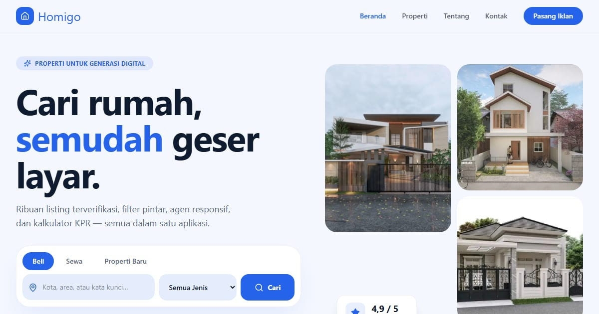

# Homigo — Cari Properti Jadi Mudah

Marketplace properti modern: jual, beli, dan sewa rumah, apartemen, ruko, tanah, dan villa di seluruh Indonesia.

**Demo live:** https://properti-homigo.vercel.app



> Template marketplace properti dengan data listing contoh. Formulir kontak hanya demo.

## Konsep

PropTech: putih-slate dengan biru elektrik. Berandanya punya pencarian bertab (Beli/Sewa/Baru), kolase bento, dan kalkulator KPR interaktif.

Semua varian punya `/properti` dengan filter, halaman detail dengan galeri foto dan video, serta `/kontak` dan `/tentang`.

## Halaman

`/` · `/kontak` · `/properti` · `/properti/[id]` · `/tentang`

## Teknologi

- Next.js 15.5 (App Router) dan React 19
- Tailwind CSS v4
- JavaScript
- Framer Motion, Lucide (ikon)
- Font: Space Grotesk, Inter (next/font)
- SEO: metadata per halaman, Open Graph, JSON-LD, sitemap.xml, dan robots.txt

## Menjalankan secara lokal

```bash
npm install
npm run dev
```

Buka http://localhost:3000. Untuk build produksi: `npm run build` lalu `npm start`.

---

Bagian dari koleksi 4 template marketplace properti di [PortalProperti](https://portal-properti-nu.vercel.app). Dibuat oleh [PintuWeb](https://pintuweb.com), jasa pembuatan website.
